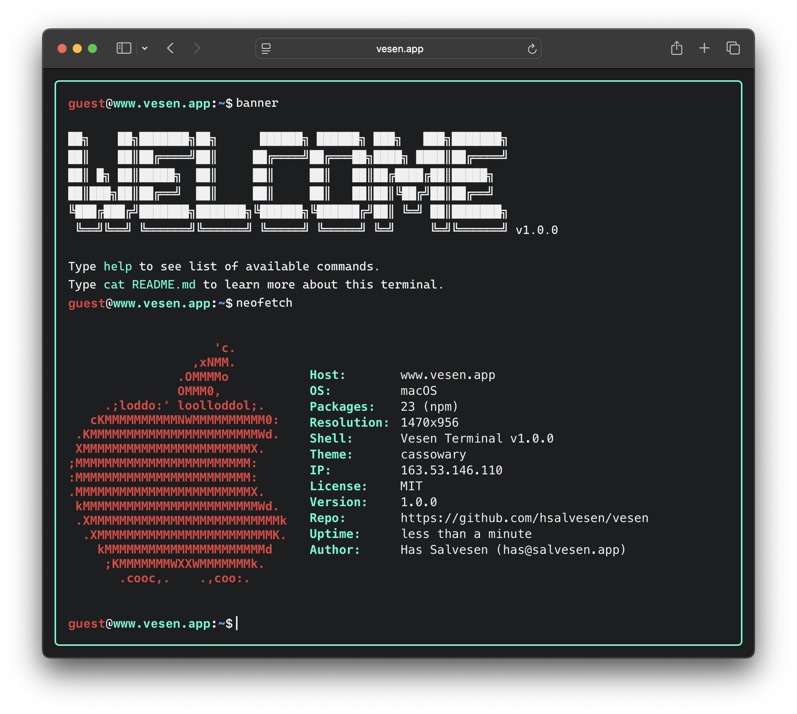
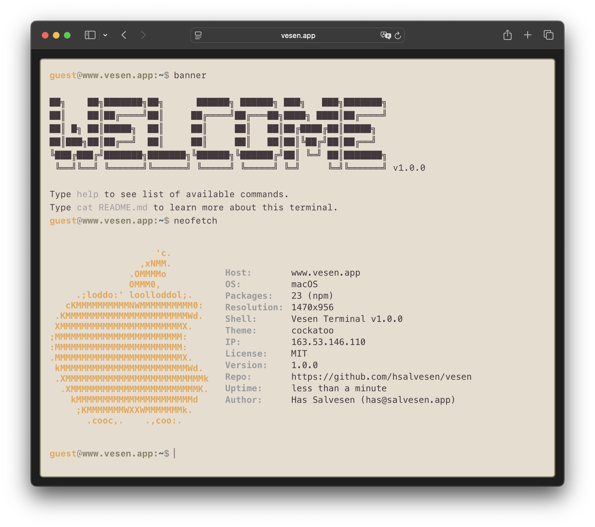
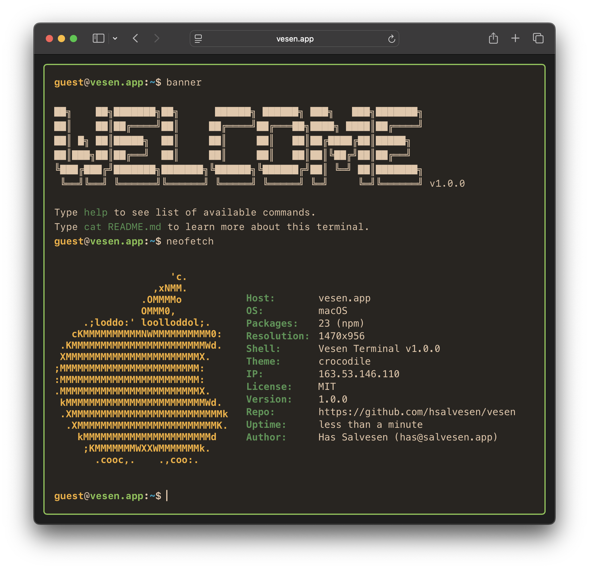
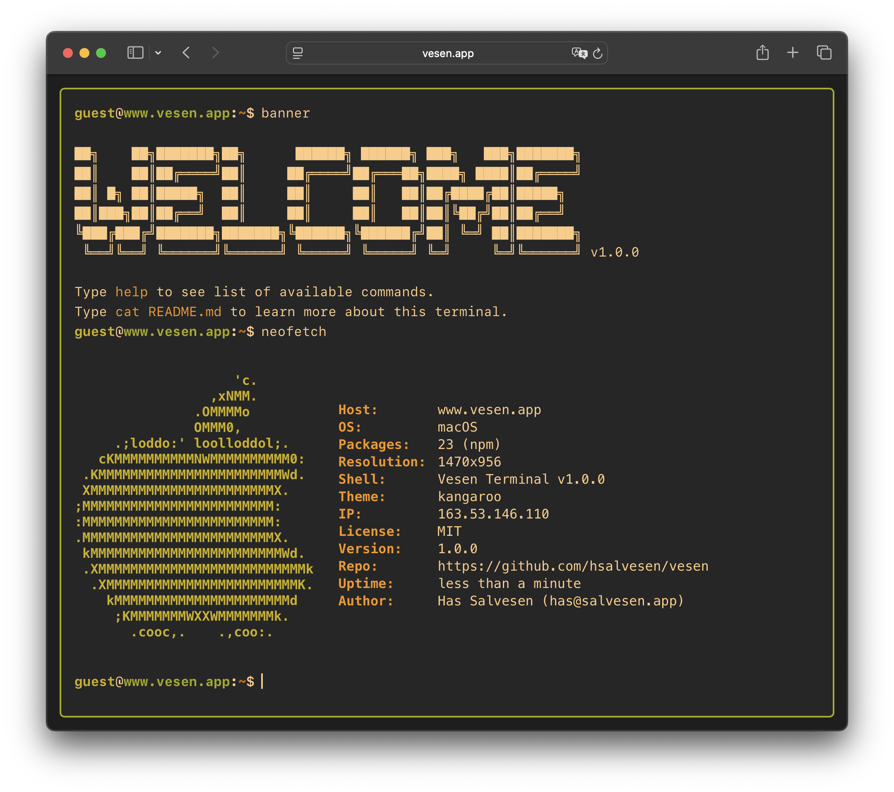
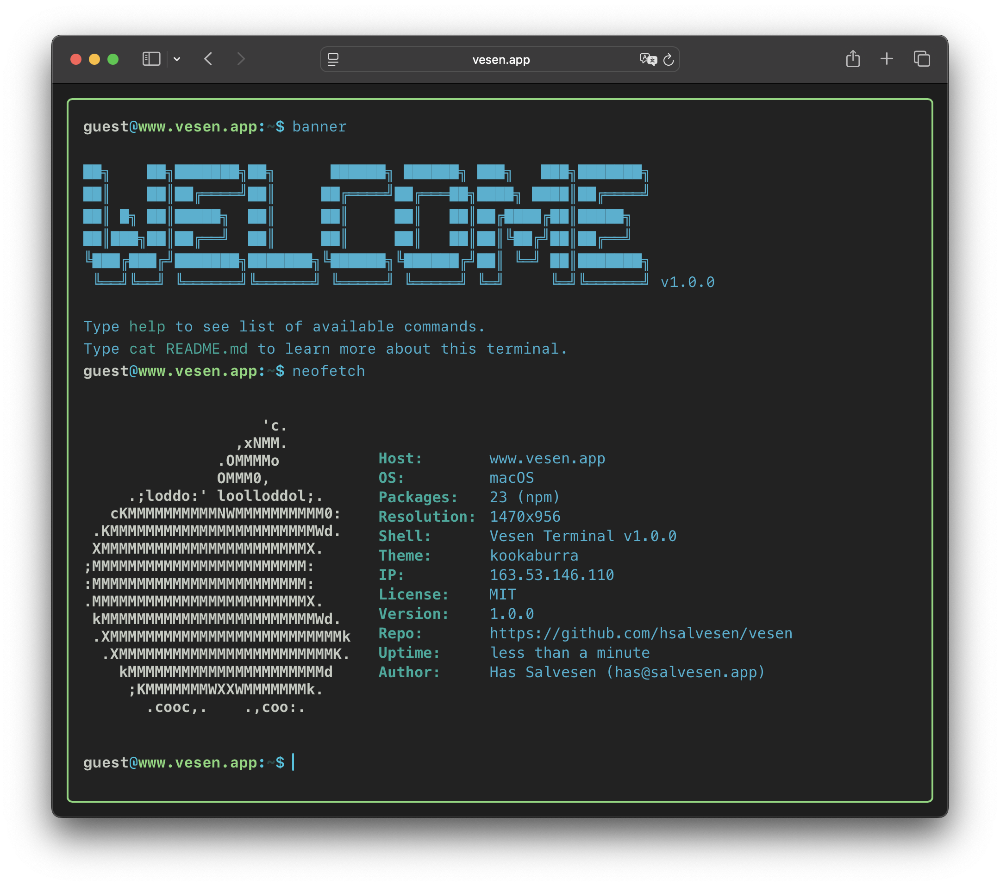
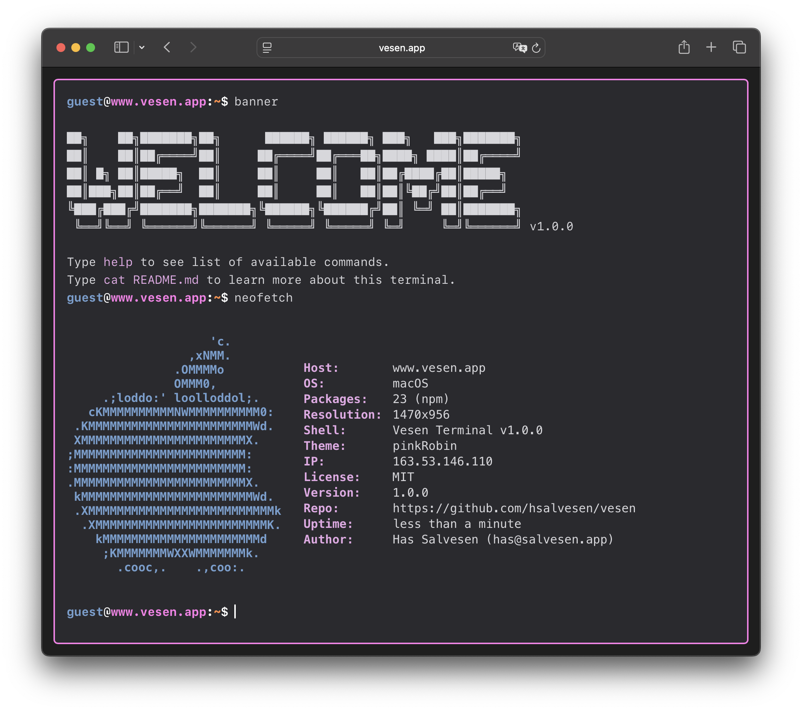
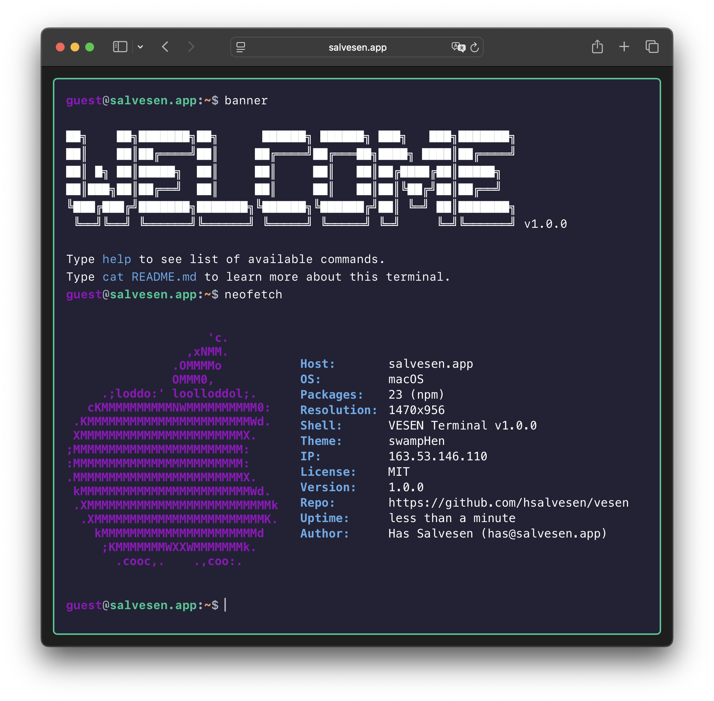
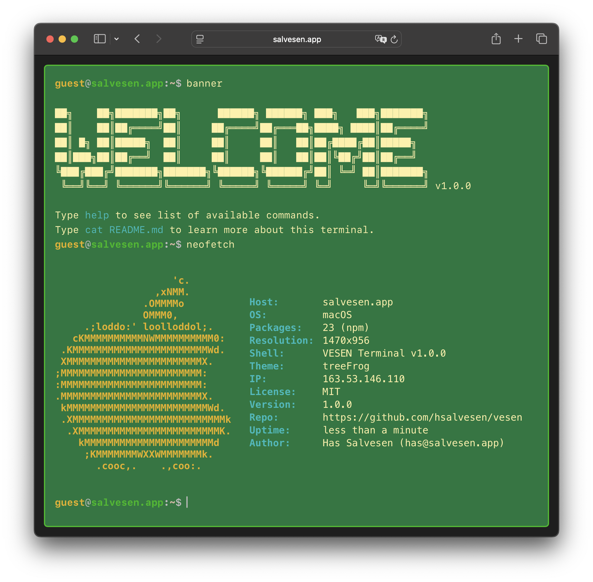
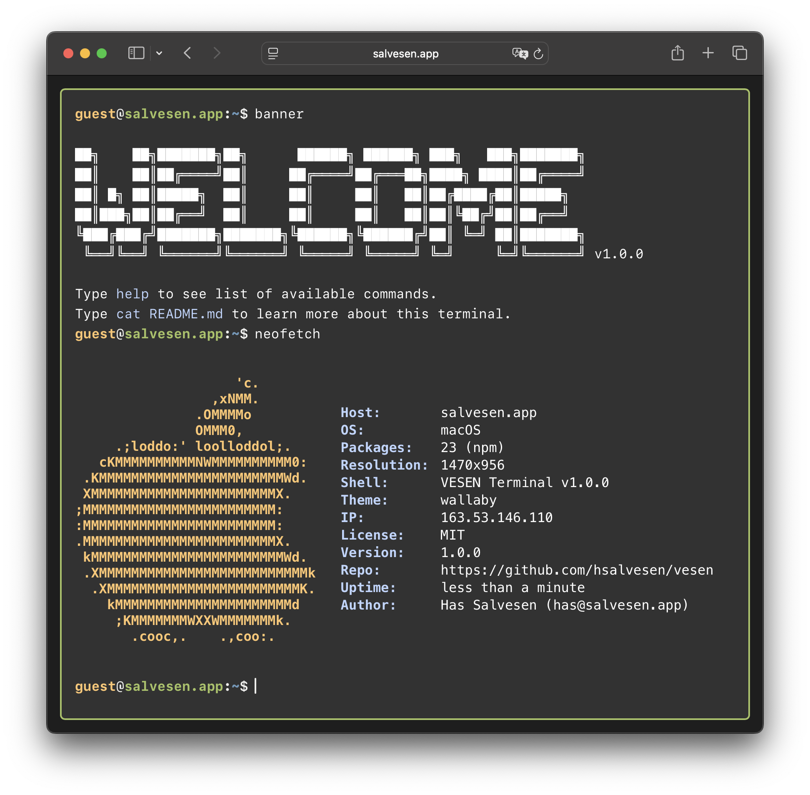
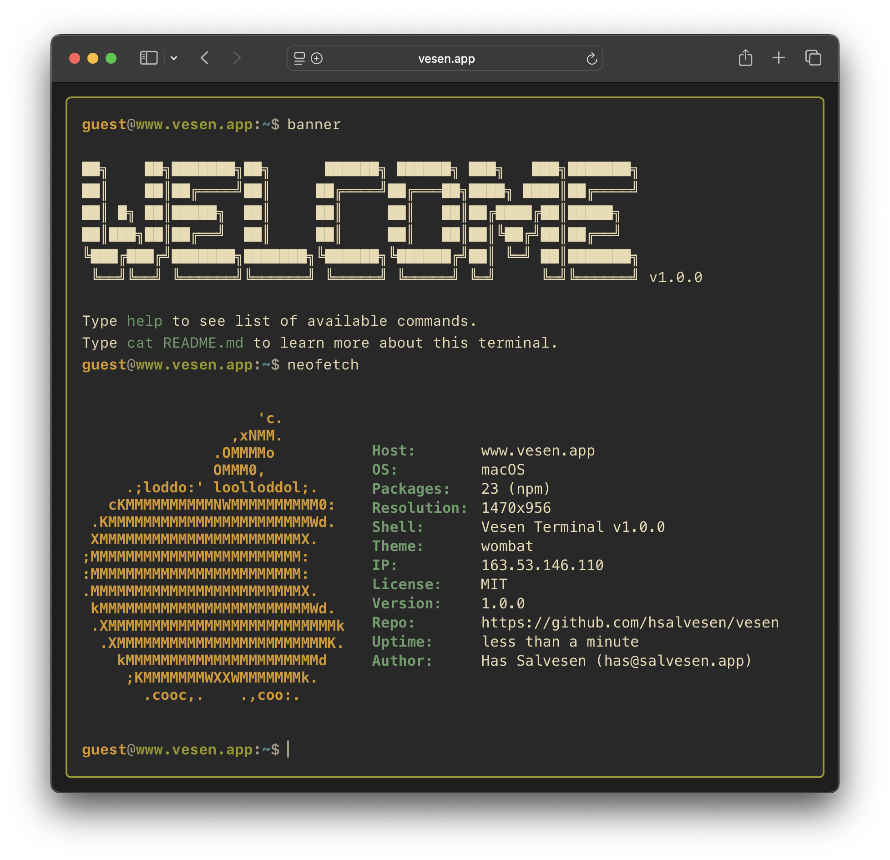

# Vesen Themes

### 1. Cassowary


### 2. Cockatoo


### 3. Crocodile


### 4. Kangaroo


### 5. Kookaburra


### 6. Pink Robin


### 7. Swamp Hen


### 8. Tree Frog


### 9. Wallaby


### 10. Wombat



## Usage

Users can switch themes using the `theme` command in the terminal:
```bash
theme <theme-name>
```

For example:
```bash
theme cassowary
theme wombat
```