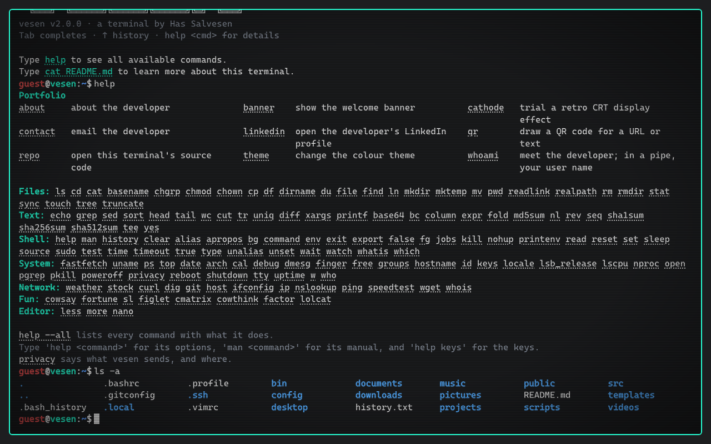
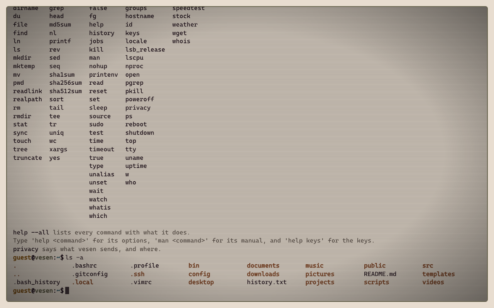
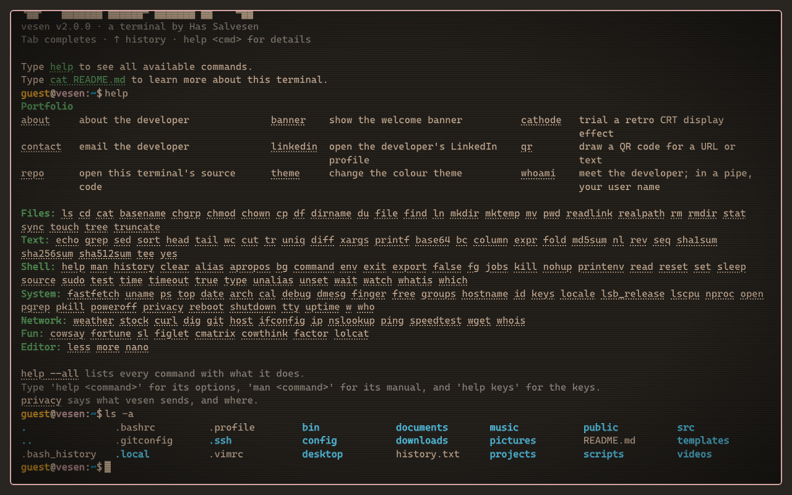
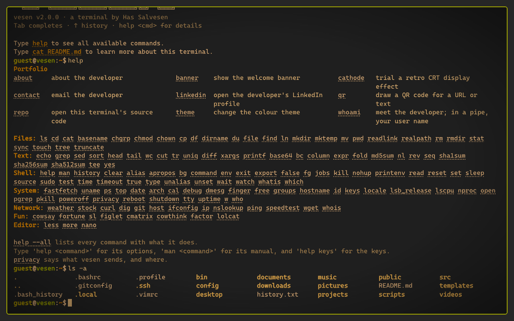
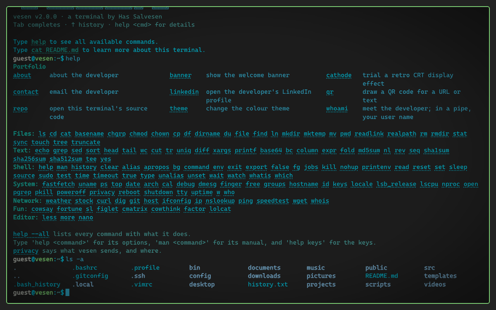
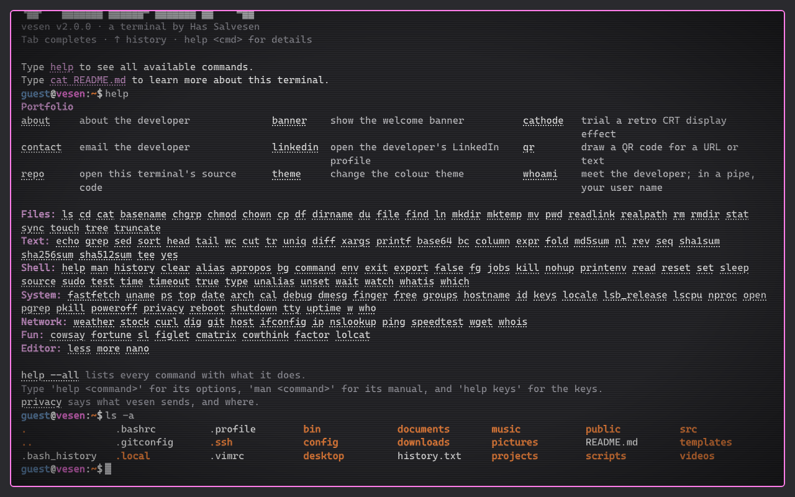
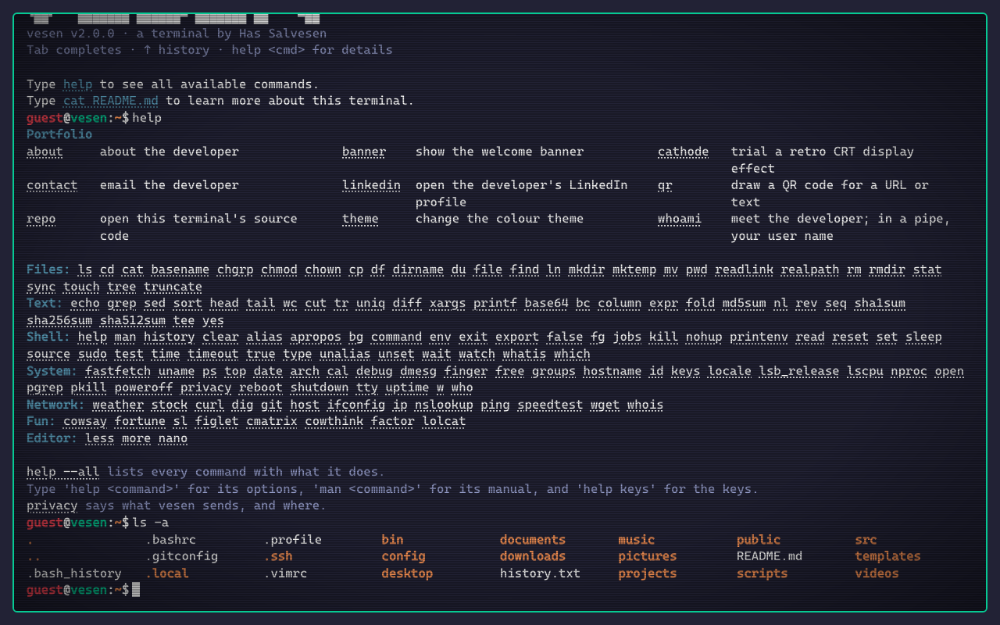
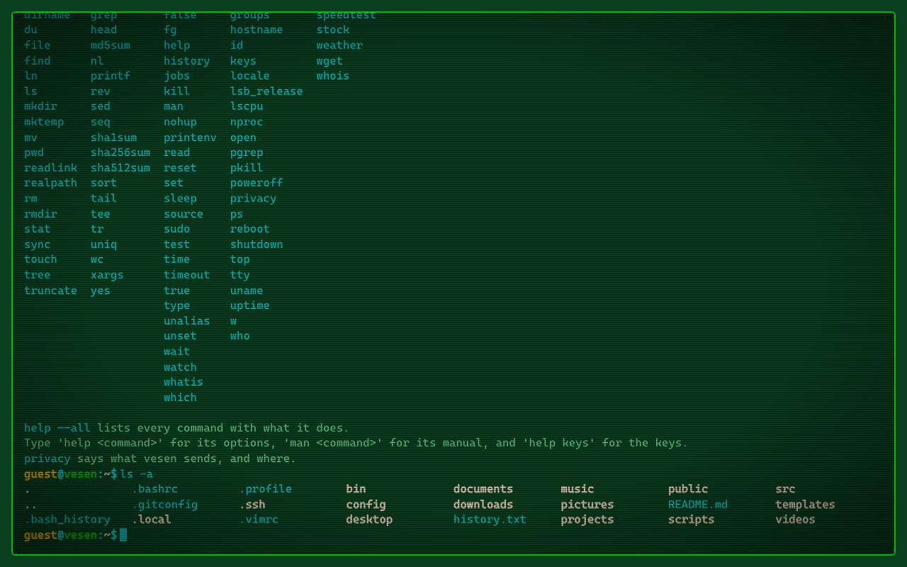
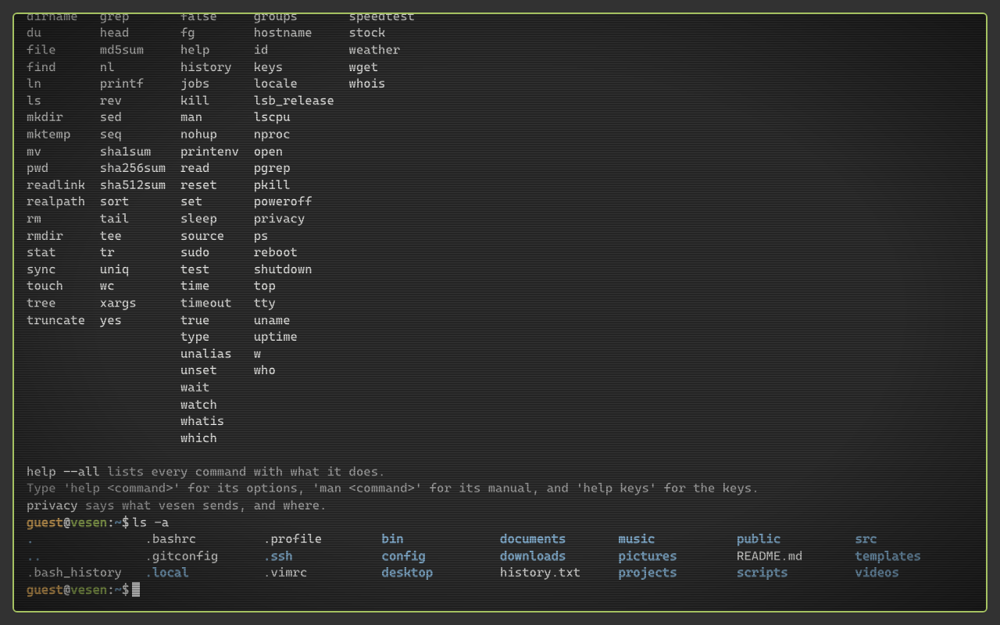
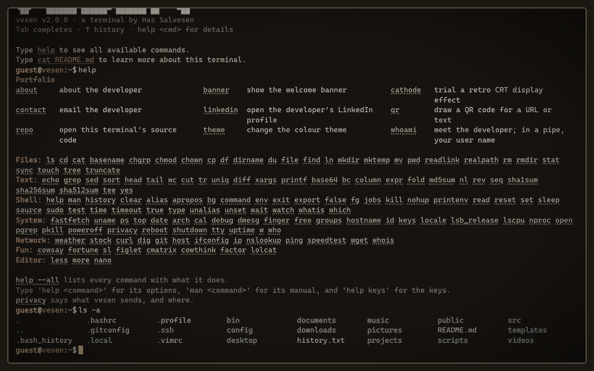

# Vesen themes

Each screenshot shows the banner, `help` and `ls -a` at 1280×800. They are generated from the built app, so they match what visitors see: run `npm run build && node scripts/theme-screenshots.mjs` after changing a theme or the look. With ffmpeg installed, the same script rebuilds `themes.gif`.

Every theme passes the contrast check (`npm run check:contrast -- --strict`): text in each role reaches at least 4.5:1 on the theme's background.

## Cassowary


## Cockatoo


## Crocodile


## Kangaroo


## Kookaburra


## Petroica


## Swamphen


## Treefrog


## Wallaby


## Wombat



## Usage

List the themes, each with its colours, with `theme ls`. Switch themes with the `theme set` command:
```bash
theme set <theme-name>
```

For example:
```bash
theme set cassowary
theme set wombat
```