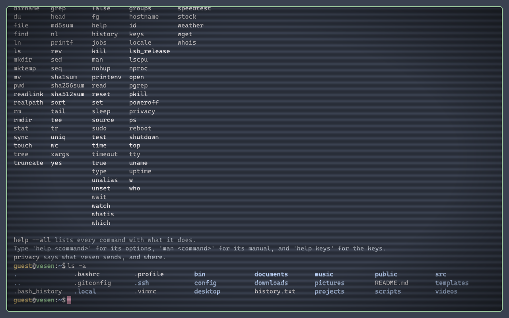
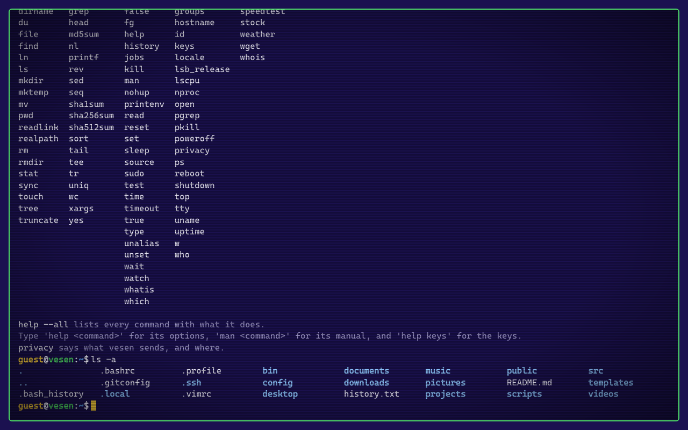
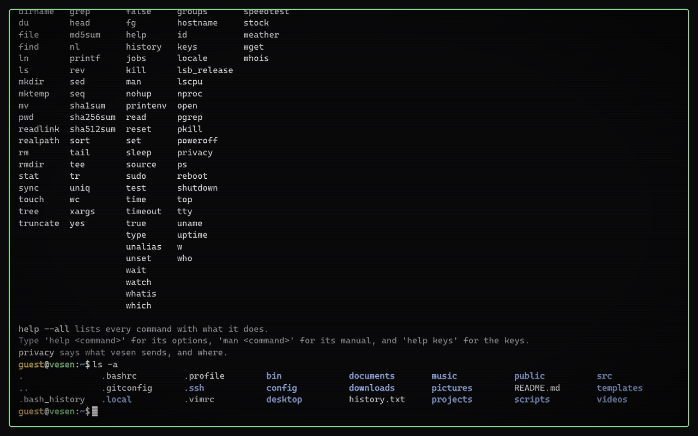
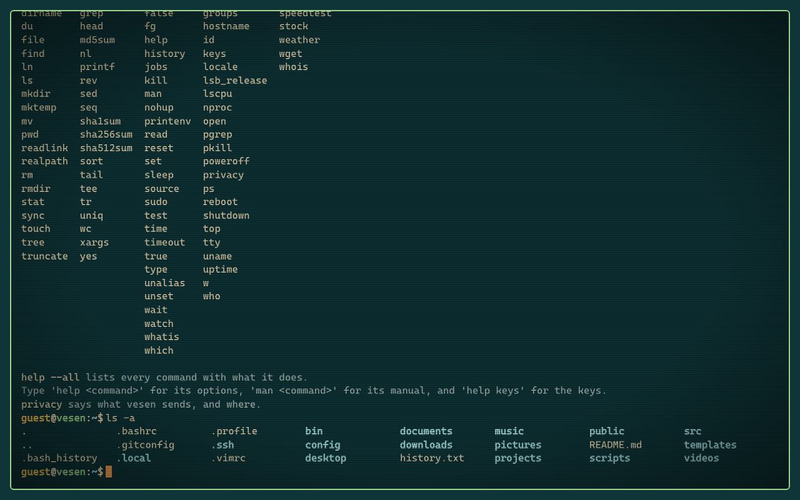
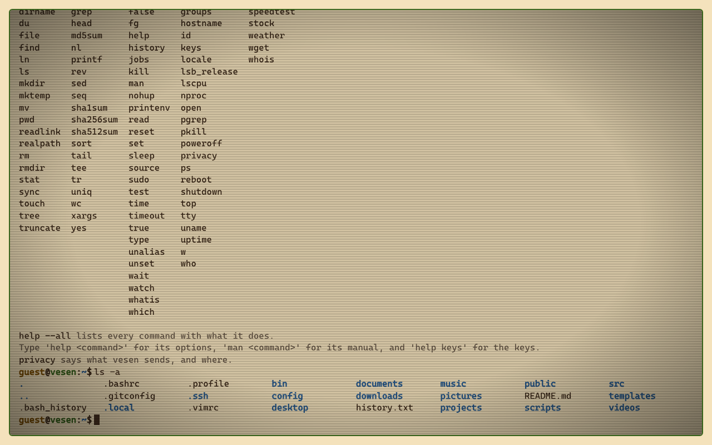

# Vesen themes

Each screenshot shows the banner, `help` and `ls -a` at 1280×800. They are generated from the built app, so they match what visitors see: run `npm run build && node scripts/theme-screenshots.mjs` after changing a theme or the look. With ffmpeg installed, the same script rebuilds `themes.gif`.

Every theme passes the contrast check (`npm run check:contrast -- --strict`): text in each role reaches at least 4.5:1 on the theme's background.

## Cassowary


## Cockatoo


## Crocodile


## Galah
The pink-and-grey cockatoo: a slate-grey background, pink and rose accents, soft white text.



## Kangaroo


## Kookaburra


## Lorikeet
The rainbow lorikeet: a deep indigo background with vivid red, green, yellow, blue, purple and cyan.



## Magpie
Near-black, white text and a blue-black sheen for the accent, in crisp high contrast; red stays red for errors.



## Petroica


## Platypus
A dark river-teal background, sand text, bill-orange and brown accents and a duck-egg blue.



## Quokka
The second light theme, after cockatoo: a warm sand background, dark brown text and cheerful accents dark enough to read.



## Swamphen


## Treefrog


## Wallaby


## Wombat


## Usage

List the themes, each with its colours, with `theme ls`. Switch with the theme's name:
```bash
theme <theme-name>
```

For example:
```bash
theme cassowary
theme wombat
```
