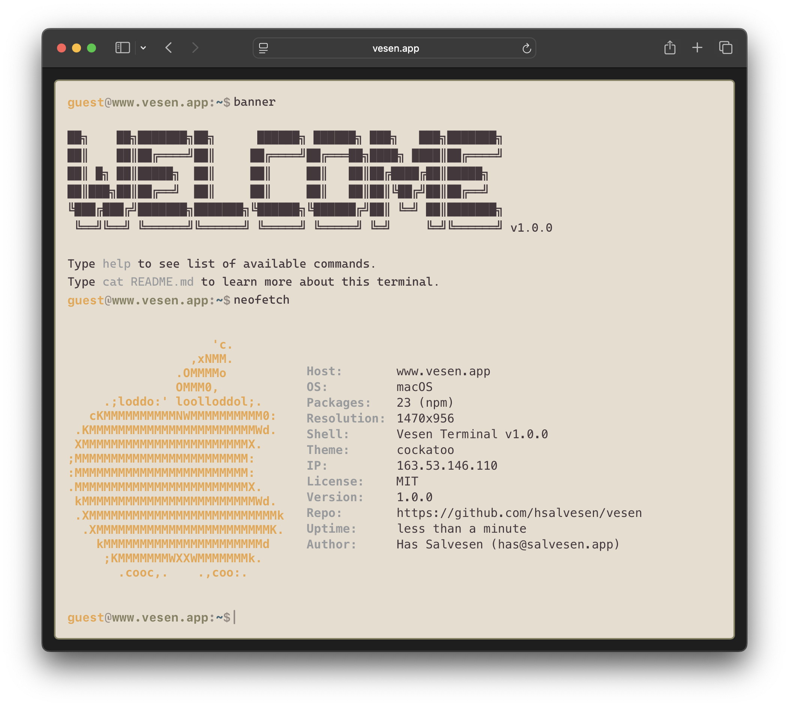
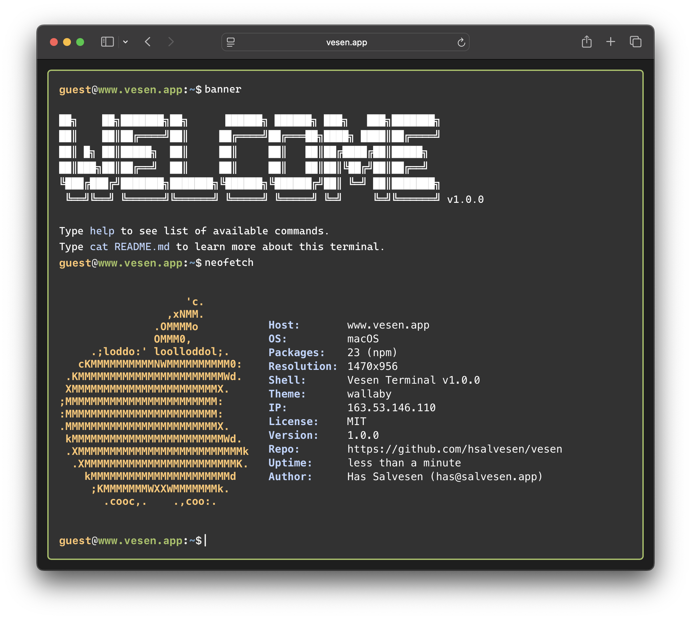

# Vesen themes

## Cassowary


## Cockatoo


## Crocodile


## Kangaroo


## Kookaburra


## Pink Robin


## Swamp Hen


## Tree Frog


## Wallaby


## Wombat


## Usage

Users can switch themes using the `theme` command in the terminal:
```bash
theme <theme-name>
```

For example:
```bash
theme cassowary
theme wombat
```