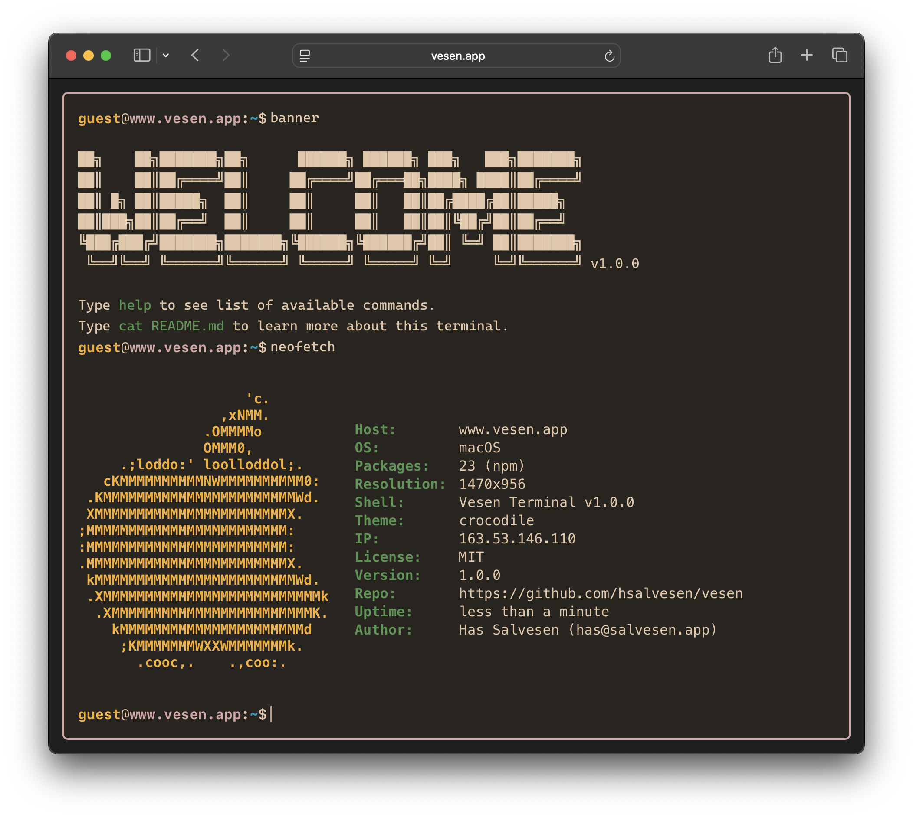
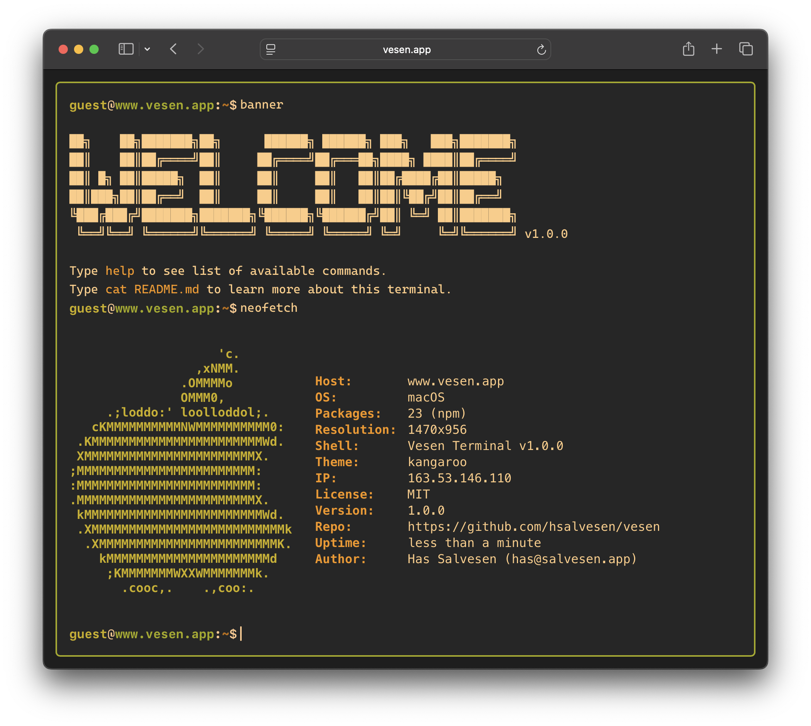

# Vesen themes

## Cassowary


## Cockatoo


## Crocodile


## Kangaroo


## Kookaburra


## Treefrog


## Petroica


## Swamphen


## Wallaby


## Wombat


## Usage

Users can switch themes using the `theme set` command in the terminal:
```bash
theme set <theme-name>
```

For example:
```bash
theme set cassowary
theme set wombat
```